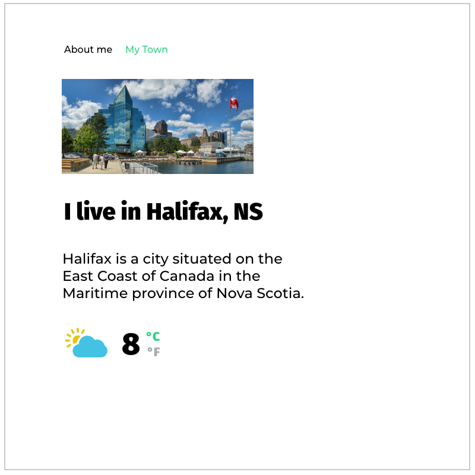
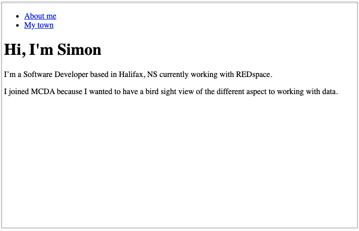
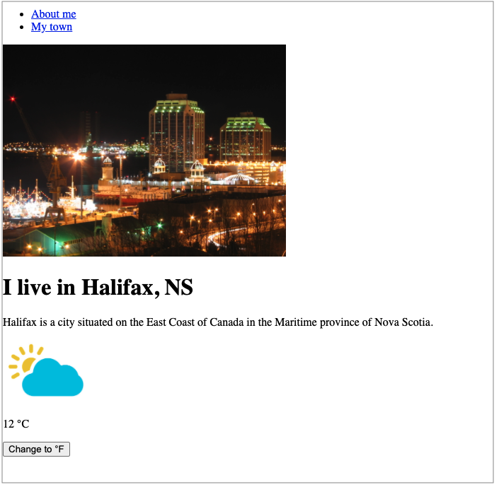

# Assignment 

I tried to make the assignment as fun and beneficial as possible... 😅 

You will create a mini personal web app, talking about yourself and your town.

## Requirements
A React app with **two** views (or pages). You can create it by running the `create-react-app` command, or by using the built-in react project in Visual Studio.

### 1st View: "About me"
- Add your name as the headline
- Write a paragraph about yourself and another paragraph about why you joined the MCDA program.

### 2st View: "My Town"
- Add a picture of your town (could be the city where you currently live or your hometown).
- Add the town's name (e.g. "I live in Halifax, NS" or "I'm from Beirut, Lebanon") .
- Add the current weather of that city (see section below).

### Navigation
- Add two `<a>` tags: "About me" and "My Town" (you can any other tag that you can make clickable). 
- When "About me" is clicked the 1st View is shown
- When "My Town" is clicked the 2nd View is shown
- Hint: use state ;) 

### Current Weather
- This is the hardest part of the assignment
- The goal of this exercise is to fetch data from an API and populate it to the UI
- You can use an actual Weather API (like [OpenWeatherMap](https://openweathermap.org/api)) OR you can just use the Weather Forcast Controller (`WeatherForecastController.cs`) that comes out of the box when creating a React app on Visual Studio (it generates random numbers but that's okay it works for now).
- Add a picture next to the temprature text (see `assets/`). The picture should be:     
    - `cold.png` if the temprature is 10°C or lower
    - `mild.png` if the temprature is higher than 10°C  but lower than 20°C 
    - `sunny.png` if the temprature is higher than 20°C 

### BONUS
Add a button "Change to °F", that if clicked will display the temprature in Fahrenheit and will display "Change to °C" and when clicked again it will display the temprature back in Celsius. 

```
Formula (from Celsius to Fahrenheit, where T is the temprature in Celsius):

(T . 9/5) + 32 
```

## Design Inspiration



